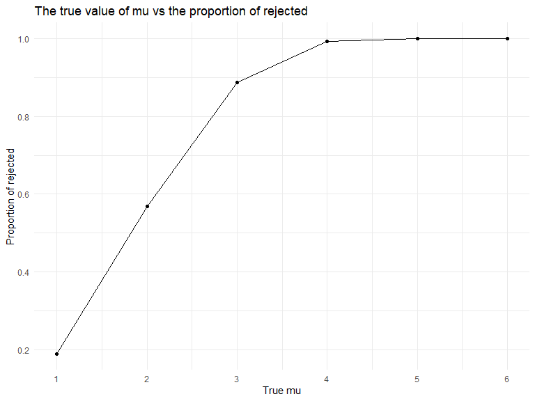

p8105_hw5_yx2711
================
Yingchen Xu
2022-11-15

# Problem 1

Use the `list.files()` function to create the dataframe containing all
file names. Use the `map()` function to iterate file names, read in the
data, and save the result as `full_df`.

``` r
full_df = 
  tibble(
    files = list.files("hw5_data/data/"),
    path = str_c("hw5_data/data/", files)
  ) %>% 
  mutate(data = map(path, read_csv)) %>% 
  unnest()
```

Tidy the results using `mutate()` and `pivot_longer()`.

``` r
tidy_df = 
  full_df %>% 
  mutate(
    files = str_replace(files, ".csv", ""),
    group = str_sub(files, 1, 3)) %>% 
  pivot_longer(
    week_1:week_8,
    names_to = "week",
    values_to = "outcome",
    names_prefix = "week_") %>% 
  mutate(week = as.numeric(week)) %>% 
  select(group, subj = files, week, outcome)
```

Make a spaghetti plot showing each subject overtime.

``` r
tidy_df %>% 
  ggplot(aes(x = week, y = outcome, group = subj, color = group)) + 
  geom_point() + 
  geom_path() + 
  facet_grid(~group)
```


There is a within-subject correlation. Subjects in the control groups do
not have a specific trend in change overtime, while subjects in the
experimental group have a linear increase in general.

# Problem 2

``` r
homicide = read.csv("data/homicide-data.csv") %>% 
  janitor::clean_names() 
```

The raw dataset contain 52179 observations and 12 variables. The key
variables are uid, reported_date, victims’ names, race, age, sex, city,
state, longitude and latitude, and one disposition variable indicating
the arrest status of the victims. The raw dataset summarizes homicides
data in 28 states and 50 cities.

Use `mutate()` to create the new variable `city_state` and recode the
possible typo of `Tulsa, AL` to `Tulsa, OK`. Create the summary table of
the total number of homicides and the number of unsolved homicides.

``` r
homicide = homicide %>% 
  mutate(
    city_state = str_c(city, ", ", state),
    city_state = recode(city_state, "Tulsa, AL" = "Tulsa, OK")
  )


summary = homicide %>% 
  group_by(city_state) %>% 
  summarize(
    total_number = n(),
    total_unsolved = sum(disposition %in% c("Closed without arrest", "Open/No arrest")
  ))

summary %>% knitr::kable()
```

| city_state         | total_number | total_unsolved |
|:-------------------|-------------:|---------------:|
| Albuquerque, NM    |          378 |            146 |
| Atlanta, GA        |          973 |            373 |
| Baltimore, MD      |         2827 |           1825 |
| Baton Rouge, LA    |          424 |            196 |
| Birmingham, AL     |          800 |            347 |
| Boston, MA         |          614 |            310 |
| Buffalo, NY        |          521 |            319 |
| Charlotte, NC      |          687 |            206 |
| Chicago, IL        |         5535 |           4073 |
| Cincinnati, OH     |          694 |            309 |
| Columbus, OH       |         1084 |            575 |
| Dallas, TX         |         1567 |            754 |
| Denver, CO         |          312 |            169 |
| Detroit, MI        |         2519 |           1482 |
| Durham, NC         |          276 |            101 |
| Fort Worth, TX     |          549 |            255 |
| Fresno, CA         |          487 |            169 |
| Houston, TX        |         2942 |           1493 |
| Indianapolis, IN   |         1322 |            594 |
| Jacksonville, FL   |         1168 |            597 |
| Kansas City, MO    |         1190 |            486 |
| Las Vegas, NV      |         1381 |            572 |
| Long Beach, CA     |          378 |            156 |
| Los Angeles, CA    |         2257 |           1106 |
| Louisville, KY     |          576 |            261 |
| Memphis, TN        |         1514 |            483 |
| Miami, FL          |          744 |            450 |
| Milwaukee, wI      |         1115 |            403 |
| Minneapolis, MN    |          366 |            187 |
| Nashville, TN      |          767 |            278 |
| New Orleans, LA    |         1434 |            930 |
| New York, NY       |          627 |            243 |
| Oakland, CA        |          947 |            508 |
| Oklahoma City, OK  |          672 |            326 |
| Omaha, NE          |          409 |            169 |
| Philadelphia, PA   |         3037 |           1360 |
| Phoenix, AZ        |          914 |            504 |
| Pittsburgh, PA     |          631 |            337 |
| Richmond, VA       |          429 |            113 |
| Sacramento, CA     |          376 |            139 |
| San Antonio, TX    |          833 |            357 |
| San Bernardino, CA |          275 |            170 |
| San Diego, CA      |          461 |            175 |
| San Francisco, CA  |          663 |            336 |
| Savannah, GA       |          246 |            115 |
| St. Louis, MO      |         1677 |            905 |
| Stockton, CA       |          444 |            266 |
| Tampa, FL          |          208 |             95 |
| Tulsa, OK          |          584 |            193 |
| Washington, DC     |         1345 |            589 |

The above table summarizes within cities the total number of homicides
indicating by `total_number` and the number of unsolved homicides
indicating by `total_unsolved`.

Use `prop.test()` function to estimate the proportion of unsolved
homicides in Baltimore, MD.

``` r
baltimore_test = prop.test(
    summary %>% filter(city_state == "Baltimore, MD") %>% pull(total_unsolved),
    summary %>% filter(city_state == "Baltimore, MD") %>% pull(total_number)
    ) %>% 
  broom::tidy()

baltimore_test %>% 
  select(estimate, conf.low, conf.high) %>% 
  knitr::kable(digits = 3)
```

| estimate | conf.low | conf.high |
|---------:|---------:|----------:|
|    0.646 |    0.628 |     0.663 |

The estimate of proportion of homicides that are unsolved in Baltimore
is 0.6455607 (95% CI: 0.6275625 to 0.6631599).

Write a `function(x)` for repeating the process of prop.test.

``` r
prop_test = function(x){
  
  summary = x %>% 
  summarize(
    total_number = n(),
    total_unsolved = sum(disposition %in% c("Closed without arrest", "Open/No arrest")
  ))
  
  city_test = prop.test(
    summary %>% pull(total_unsolved),
    summary %>% pull(total_number)
    ) %>% 
  broom::tidy()
  
  city_test
  
}
```

Nesting the unrelated columns. Map the nested data to the function
`prop_test` to iterate the process of proportional testing.

``` r
homicide_nest = homicide %>%
  select(city_state, everything()) %>% 
  nest(data = uid:disposition)

 homicide_test = homicide_nest %>% 
  mutate(test = map(data, prop_test)) %>% 
  unnest(test)
 
homicide_test %>% 
   select(city_state, estimate, conf.low, conf.high) %>% 
   knitr::kable(digits = 3)
```

| city_state         | estimate | conf.low | conf.high |
|:-------------------|---------:|---------:|----------:|
| Albuquerque, NM    |    0.386 |    0.337 |     0.438 |
| Atlanta, GA        |    0.383 |    0.353 |     0.415 |
| Baltimore, MD      |    0.646 |    0.628 |     0.663 |
| Baton Rouge, LA    |    0.462 |    0.414 |     0.511 |
| Birmingham, AL     |    0.434 |    0.399 |     0.469 |
| Boston, MA         |    0.505 |    0.465 |     0.545 |
| Buffalo, NY        |    0.612 |    0.569 |     0.654 |
| Charlotte, NC      |    0.300 |    0.266 |     0.336 |
| Chicago, IL        |    0.736 |    0.724 |     0.747 |
| Cincinnati, OH     |    0.445 |    0.408 |     0.483 |
| Columbus, OH       |    0.530 |    0.500 |     0.560 |
| Dallas, TX         |    0.481 |    0.456 |     0.506 |
| Denver, CO         |    0.542 |    0.485 |     0.598 |
| Detroit, MI        |    0.588 |    0.569 |     0.608 |
| Durham, NC         |    0.366 |    0.310 |     0.426 |
| Fort Worth, TX     |    0.464 |    0.422 |     0.507 |
| Fresno, CA         |    0.347 |    0.305 |     0.391 |
| Houston, TX        |    0.507 |    0.489 |     0.526 |
| Indianapolis, IN   |    0.449 |    0.422 |     0.477 |
| Jacksonville, FL   |    0.511 |    0.482 |     0.540 |
| Kansas City, MO    |    0.408 |    0.380 |     0.437 |
| Las Vegas, NV      |    0.414 |    0.388 |     0.441 |
| Long Beach, CA     |    0.413 |    0.363 |     0.464 |
| Los Angeles, CA    |    0.490 |    0.469 |     0.511 |
| Louisville, KY     |    0.453 |    0.412 |     0.495 |
| Memphis, TN        |    0.319 |    0.296 |     0.343 |
| Miami, FL          |    0.605 |    0.569 |     0.640 |
| Milwaukee, wI      |    0.361 |    0.333 |     0.391 |
| Minneapolis, MN    |    0.511 |    0.459 |     0.563 |
| Nashville, TN      |    0.362 |    0.329 |     0.398 |
| New Orleans, LA    |    0.649 |    0.623 |     0.673 |
| New York, NY       |    0.388 |    0.349 |     0.427 |
| Oakland, CA        |    0.536 |    0.504 |     0.569 |
| Oklahoma City, OK  |    0.485 |    0.447 |     0.524 |
| Omaha, NE          |    0.413 |    0.365 |     0.463 |
| Philadelphia, PA   |    0.448 |    0.430 |     0.466 |
| Phoenix, AZ        |    0.551 |    0.518 |     0.584 |
| Pittsburgh, PA     |    0.534 |    0.494 |     0.573 |
| Richmond, VA       |    0.263 |    0.223 |     0.308 |
| San Antonio, TX    |    0.429 |    0.395 |     0.463 |
| Sacramento, CA     |    0.370 |    0.321 |     0.421 |
| Savannah, GA       |    0.467 |    0.404 |     0.532 |
| San Bernardino, CA |    0.618 |    0.558 |     0.675 |
| San Diego, CA      |    0.380 |    0.335 |     0.426 |
| San Francisco, CA  |    0.507 |    0.468 |     0.545 |
| St. Louis, MO      |    0.540 |    0.515 |     0.564 |
| Stockton, CA       |    0.599 |    0.552 |     0.645 |
| Tampa, FL          |    0.457 |    0.388 |     0.527 |
| Tulsa, OK          |    0.330 |    0.293 |     0.371 |
| Washington, DC     |    0.438 |    0.411 |     0.465 |

Create a plot that shows the estimates and CI for each city

``` r
homicide_test %>% 
  mutate(
    city_state = fct_reorder(city_state, estimate)
  ) %>% 
  ggplot(aes(x = city_state, y = estimate)) +
  geom_point() +
  geom_errorbar(aes(ymin = conf.low, ymax = conf.high)) +
  labs(
    title = "The estimates and CIs for proportion of unsolved homicides for each city",
    x = "City, State",
    y = "Estimate Proportion") +
  theme(axis.text.x = element_text(angle = 90))
```


Need interpretation of graph.

# Problem 3

First write down the function to simulate data from a normal
distribution, run a t.test, and return the estimates of t-statistics and
p-value.

``` r
t_test = function(n = 30, mu, sigma = 5) {
  
  x = rnorm(n, mean = mu, sd = sigma)
  
  t_test =
    t.test(x, mu = 0) %>% 
    broom::tidy() 
  
  t_test %>% 
    select(estimate, p.value)
  
}
```

Then, generate 5000 datasets from `rnorm()` and run the `t_test` for mu
= 0. Save the resulting estimate and p-value as `sim_mu0_df`.

``` r
sim_mu0_df = 
  expand_grid(
    true_mu = 0,
    iter = 1:5000
  ) %>% 
  mutate(
    estimate_df = map(.x = true_mu, ~ t_test(mu = .x))
  ) %>% 
  unnest()
```

Repeat the above process for mu = {1, 2, 3, 4, 5, 6}

``` r
sim_mu_df = 
  expand_grid(
    true_mu = c(1, 2, 3, 4, 5, 6),
    iter = 1:10
  ) %>% 
  mutate(
    estimate_df = map(.x = true_mu, ~ t_test(mu = .x))
  ) %>% 
  unnest()
```

Create a dataframe called `sim_mu_summary` with the summary data of
total number of tests, total number of reject, and the proportion of
reject. Plot a graph with the true value of mu on the x-axis and the
proportion of reject on the y-axis.

``` r
sim_mu_summary = sim_mu_df %>% 
  mutate(
    results = ifelse(
      p.value < 0.05, "Reject", "Fail to reject"
    )) %>% 
  group_by(true_mu) %>% 
  summarize(
    total = n(),
    reject = sum(results == "Reject")
  ) %>% 
  mutate(
    prop = reject / total
  )
  
sim_mu_summary %>% 
  ggplot(aes(x = true_mu, y = prop)) +
  geom_path() + 
  labs(
    title = "The true value of mu vs the proportion of rejected",
    x = "True mu",
    y = "Proportion of rejected")  +
  scale_fill_continuous(breaks = c(1, 2, 3, 4, 5, 6))
```



As the effect size, ie, the true mu, increases, the power, ie, the
proportion of times the null was rejected will increase.

Make a plot showing the average estimate of mu hat on the y axis and the
true value of mu on the x-axis.

``` r
sim_mu_df %>% 
  ggplot(aes(x = true_mu, y = estimate)) +
  geom_point()
```


``` r
sim_mu_df %>%
  mutate(
    results = ifelse(
      p.value < 0.05, "Reject", "Fail to reject"
    )) %>% 
  filter(results == "Reject") %>% 
  ggplot(aes(x = true_mu, y = mean(estimate))) +
  geom_point()
```


